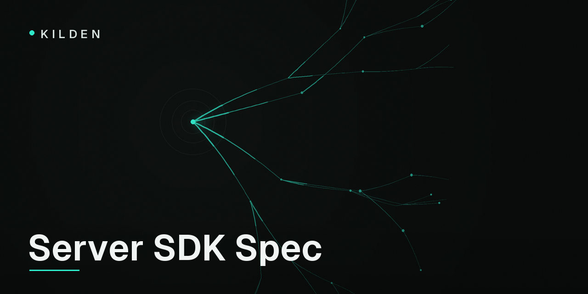

<p align="center">
  
</p>

# kilden-sdk-spec

[](https://github.com/freshworkstudio/kilden-sdk-spec/actions/workflows/ci.yml)
[](LICENSE)

[Kilden](https://kilden.io) is a customer data platform — analytics,
campaigns and session replay on one event pipeline. This repo is the
**single source of truth** for its server-side SDKs
([PHP](https://github.com/freshworkstudio/kilden-sdk-php),
[Node](https://github.com/freshworkstudio/kilden-sdk-node),
[Python](https://github.com/freshworkstudio/kilden-sdk-python),
[Ruby](https://github.com/freshworkstudio/kilden-sdk-ruby),
[Go](https://github.com/freshworkstudio/kilden-sdk-go)): one spec, one set
of frozen test vectors, one mock server they all test against.

Five SDKs drift apart the moment each one grows its own mocks and its own
reading of the docs. The fix is structural, not disciplinary:

- **[`SPEC.md`](SPEC.md)** — the public surface and twelve numbered behavior
  contracts. Language-idiomatic naming, identical semantics.
- **[`vectors/`](vectors/)** — frozen inputs → outputs every SDK replays in
  CI: wire payloads, byte-exact identity JWTs, flag-rollout buckets. The
  JWT and hashing vectors are generated from the platform's own Go code, so
  "matches the vectors" means "matches production".
- **[`mockserver/`](mockserver/)** — a zero-dependency stand-in for
  `ingest.kilden.io` that validates like production, records what it
  accepts, and fails on command (429 + `Retry-After`, 500, timeouts, corrupt
  responses, dropped connections) so retry behavior gets tested for real.

## Running the mock server

```sh
docker run --rm -p 8090:8090 ghcr.io/freshworkstudio/kilden-mockserver:latest
# or, from a checkout:
go run ./mockserver -addr :8090
```

```sh
curl -X POST localhost:8090/capture \
  -H 'Content-Type: application/json' \
  -d '{"write_key":"sk_test_secret","sent_at":"2026-07-14T12:00:00.500Z","batch":[{"uuid":"0197fa10-7a2b-7c3d-8e4f-5a6b7c8d9e0f","event":"smoke","distinct_id":"u1","properties":{},"timestamp":"2026-07-14T12:00:00.000Z"}]}'

curl localhost:8090/__mock/captured   # inspect what it accepted
```

Control endpoints (`/__mock/*`) let a test suite configure keys, flags,
allowed origins, and arm failures — the full contract is in
[`SPEC.md` §10](SPEC.md#10-mock-capture-server).

The mock is intentionally **stricter** than production where the spec is
stricter (canonical UUIDs, exact `YYYY-MM-DDTHH:MM:SS.mmmZ` timestamps, no
unknown payload keys): passing here implies passing production, never the
other way around.

## Changing SDK behavior

Spec first, SDKs second — see [CONTRIBUTING.md](CONTRIBUTING.md). Divergence
reports between an SDK and this spec are the most valuable issues you can
file.

## Community

- [Discussions](https://github.com/freshworkstudio/kilden-sdk-spec/discussions)
  for questions and design conversations (searchable, permanent).
- [docs.kilden.io](https://docs.kilden.io) for the product documentation.

## License

[MIT](LICENSE)
